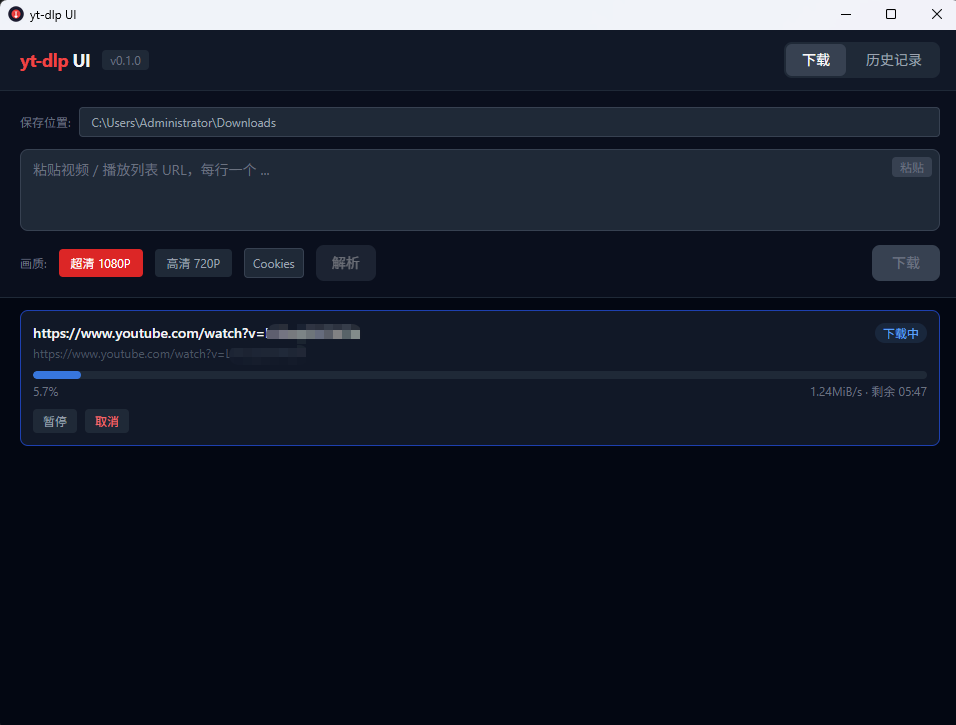

# yt-dlp UI

基于 [yt-dlp](https://github.com/yt-dlp/yt-dlp) 的跨平台视频下载图形界面，使用 **Tauri v2 + React + TypeScript** 构建。


## 功能

- **粘贴 URL 下载** — 支持单个视频、播放列表、频道链接
- **批量下载** — 多 URL 每行一个，解析播放列表/频道后可预览视频列表再下载
- **画质选择** — 超清 1080P / 高清 720P
- **实时进度** — 下载进度条、速度、ETA、文件大小
- **下载队列** — 后台并发控制，支持暂停 / 恢复 / 取消
- **一键提取 Cookies** — 选择浏览器 → 提取 → 自动生成 cookies 文件，支持 Chrome、Edge、Firefox、Opera、Vivaldi、Chromium
- **下载历史** — 本地 JSON 存储，支持搜索

## 技术栈

| 层 | 技术 |
|---|------|
| 桌面框架 | [Tauri v2](https://v2.tauri.app/) |
| 前端 | React 19 + TypeScript |
| 样式 | Tailwind CSS |
| 状态管理 | Zustand |
| 后端 | Rust（进程管理、队列调度、Cookies 提取、历史存储） |
| 下载引擎 | [yt-dlp.exe](https://github.com/yt-dlp/yt-dlp/releases) |

## 架构

```
┌──────────────────────────────────────────────────┐
│                   React 前端                       │
│  ┌──────────┐ ┌──────────┐ ┌──────────────────┐ │
│  │ URL 输入  │ │ 画质选择  │ │   下载队列列表     │ │
│  │ 批量粘贴  │ │ Cookies  │ │   进度条 + 速度    │ │
│  │ URL 解析  │ │   提取   │ │   暂停/取消/重试   │ │
│  └──────────┘ └──────────┘ └──────────────────┘ │
│  ┌──────────────────────────────────────────┐    │
│  │             下载历史记录                    │    │
│  └──────────────────────────────────────────┘    │
├──────────────────────────────────────────────────┤
│                Tauri Rust 后端                     │
│  ┌──────────┐ ┌──────────┐ ┌──────────────────┐ │
│  │ 进程管理  │ │ 队列调度  │ │   历史存储        │ │
│  │ spawn    │ │ 并发控制  │ │   JSON 文件       │ │
│  │ yt-dlp   │ │ 暂停/恢复 │ │                  │ │
│  └──────────┘ └──────────┘ └──────────────────┘ │
│  ┌──────────────────────────────────────────┐    │
│  │  Cookies 提取（SQLite + DPAPI 解密）      │    │
│  └──────────────────────────────────────────┘    │
├──────────────────────────────────────────────────┤
│              yt-dlp.exe (子进程)                   │
└──────────────────────────────────────────────────┘
```

## 环境要求

- **Node.js** >= 20
- **Rust** >= 1.77（通过 [rustup](https://rustup.rs/) 安装）
- **npm**
- **Windows**：需要 Visual Studio Build Tools 或 Windows SDK
- **yt-dlp.exe**：放在项目根目录或加入 PATH

## 快速开始

```bash
# 1. 安装 Rust
curl --proto '=https' --tlsv1.2 -sSf https://sh.rustup.rs | sh

# 2. 安装前端依赖
npm install

# 3. 下载 yt-dlp.exe 放到项目根目录
# 从 https://github.com/yt-dlp/yt-dlp/releases 下载最新版

# 4. 开发模式启动
npx tauri dev

# 5. 构建发布
npx tauri build
```

## 项目结构

```
yt-dlp-ui/
├── src/                         # React 前端
│   ├── main.tsx                 # 入口
│   ├── App.tsx                  # 主应用
│   ├── store.ts                 # Zustand 状态管理
│   ├── types.ts                 # 共享类型定义
│   └── components/
│       ├── UrlInput.tsx         # URL 输入、解析、画质选择
│       ├── DownloadQueue.tsx    # 下载队列 + 进度
│       ├── CookiesModal.tsx     # Cookies 提取弹窗
│       └── History.tsx          # 下载历史
├── src-tauri/                   # Rust 后端
│   ├── src/
│   │   ├── main.rs              # Tauri 入口
│   │   ├── lib.rs               # 命令注册
│   │   ├── ytdlp.rs             # yt-dlp 进程调用 & URL 解析
│   │   ├── queue.rs             # 下载队列调度
│   │   ├── cookies_extract.rs   # 浏览器 Cookies 提取
│   │   ├── history.rs           # 历史记录存储
│   │   └── bin/                 # 测试二进制
│   ├── Cargo.toml
│   └── tauri.conf.json
├── yt-dlp.exe                   # 下载引擎（不纳入版本控制）
├── package.json
└── README.md
```

## Cookies 提取说明

支持从以下浏览器提取 Cookies（用于下载需要登录的视频）：

- Google Chrome
- Microsoft Edge
- Mozilla Firefox
- Opera
- Vivaldi
- Chromium

**Edge 注意事项**：Edge 默认启用"启动增强"和"后台扩展"，会锁定 Cookie 数据库。提取前请前往 `edge://settings/system` 关闭这两个选项。

## 许可证

MIT
